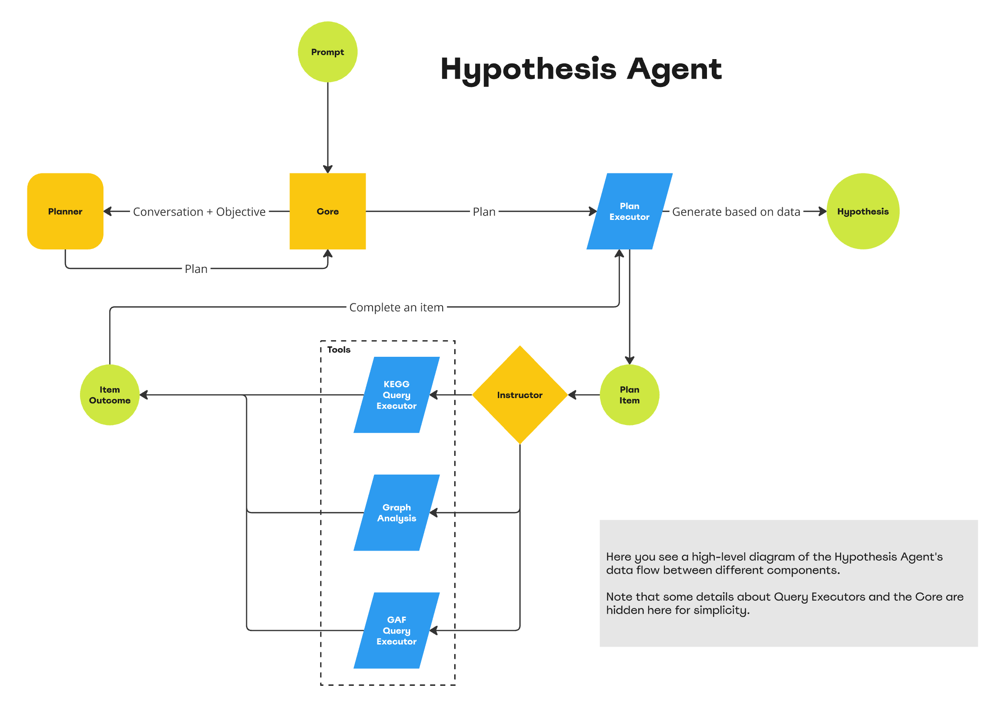
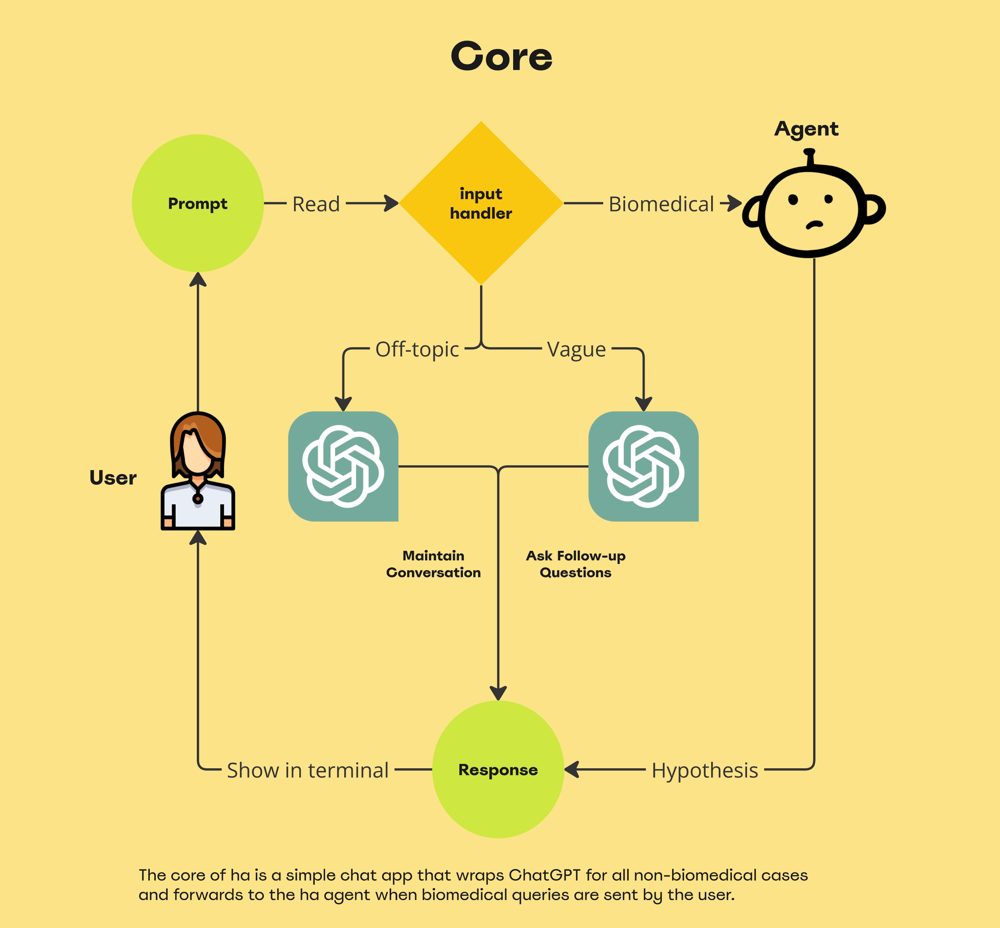
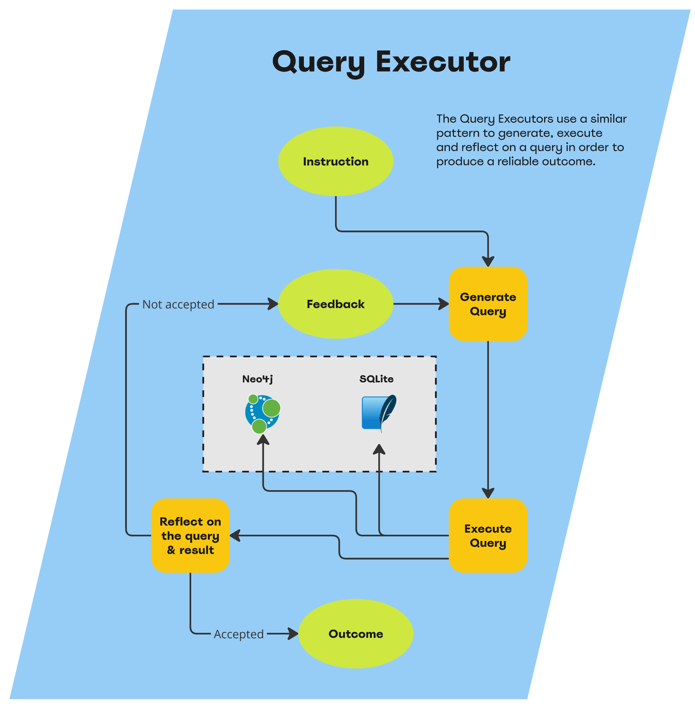

# Hypothesis Agent

The Hypothesis Agent is a Python command line application that utilises an LLM to query and analyse data from the 
biomedical domain, specifically the [GAF](https://geneontology.org/docs/go-annotation-file-gaf-format-2.0/) of the human
genome and a few [KAGG](https://www.genome.jp/kegg/pathway.html)-encoded disease pathways.

## Installation

Set your OpenAI API key in the `OPENAI_API_KEY` environment variable.

```bash
export OPENAI_API_KEY=your-api-key
```

The easy way to install the agent is to use the provided Makefile..
```bash
make install
```

### Specific Makefile commands

- `make install` - Install the agent
- `make prepare-directories` - Prepare the directories for the neo4j database
- `make download-apoc` - Download the APOC plugin
- `make download-gds` - Download the GDS plugin
- `make create-neo4j-container` - Create the neo4j container
- `make run-neo4j` - Start the neo4j container
- `make stop-neo4j` - Stop the neo4j container
- `make wipe-data` - Wipe the neo4j data
- `make import-data` - Import the data
- `make reset-neo4j` - Reset the neo4j database
- `make test-neo4j` - Test the neo4j connection
- `make test` - Run the tests
- `make test-fast` - Run the tests except the slow ones
- `make install-requirements` - Install the requirements
- `make run` - Run the agent

## Usage

The agent will keep a conversation on any topic but if the user asks about the biomedical domain, the agent will switch
to a more specific mode and query the biomedical data in order to generate a hypothesis. Typically, the agent will
make a plan for how to gather data and then execute the plan. Finally, the agent will generate a hypothesis based on the
gathered data.

### Running the agent

The agent can be run with the following command:
```bash
make run
```

Or if you want the python command:
```bash
python -m ha -W ignore
```

### Some useful prompts

```commandline
you: Tell me about INSR gene and what it impacts in the diabetes pathway.
```

```commandline
you: Explain the impact of the MLH1 gene on colorectal cancer risk.
```

```commandline
you: What role does the GLUT4 gene play in glucose uptake and diabetes?
```

### The tools that the agent uses

- Neo4j - The agent uses a Neo4j database to store the KEGG pathways data (kegg_query)
- GAF - The agent uses the GAF file to query the human genome data
- Graph Analysis - The agent uses a custom graph analysis script to generate a hypothesis about the impact of a gene on a pathway

## Architecture






## Configuration

There are a bunch of things you can change with environment variables. There is no need to do it in order to run 
the agent though (except OpenAI's key of course). Here are the most important ones:

* `NEO4J_URI` - The URI of the Neo4j database
* `NEO4J_USER` - The username of the Neo4j database
* `NEO4J_PASSWORD` - The password of the Neo4j database
* `OPENAI_API_KEY` - The OpenAI API key
* `OPENAI_NEO4J_MODEL` - The OpenAI model to use for the Neo4j queries
* `OPENAI_PANDAS_MODEL` - The OpenAI model to use for the Pandas queries
* `OPENAI_AGENT_MODEL` - The OpenAI model to use for the agent queries
* `OPENAI_API_KEY` - The OpenAI API key
